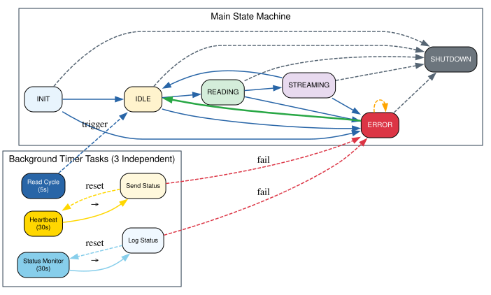
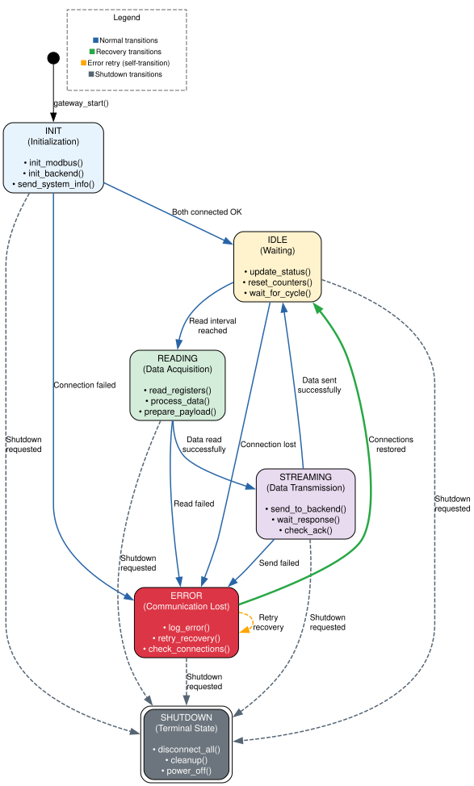
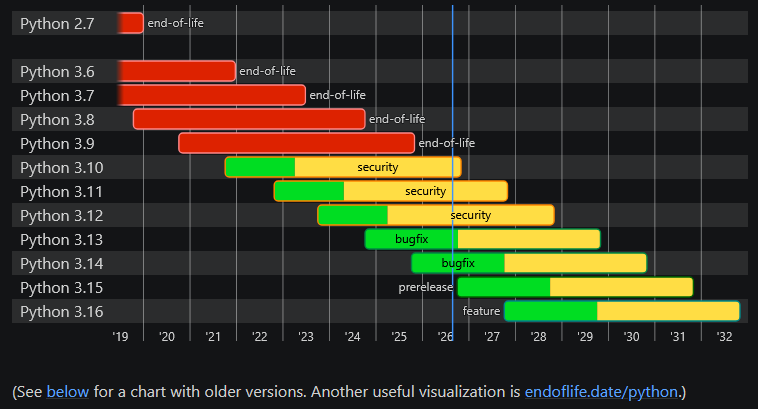

# IoT-Modbus-Gateway

Modbus to WebSocket gateway for Eco-Adapt Power-Elec 6 sensor.

## Overview

This proof of concept reads voltage and frequency from an Eco-Adapt Power-Elec 6 sensor via Modbus and sends the data to a backend server via WebSocket.

### System Workflow and State Machine




## Python Version

This project uses **Python 3.14.0** for the following reasons:

- **Stability**: Python 3.14.0 is a stable release with all major features finalized
- **Long-term Support**: According to Python's official release schedule, Python 3.14 will be maintained with security fixes until **October 2031**
- **Modern Features**: Includes the latest async/await improvements and performance optimizations
- **Backward Compatibility**: Fully compatible with Python 3.7+ code while offering better performance

### Python Version Support
> [Python versions](https://devguide.python.org/versions/#versions)


## Quick Start

### Install Dependencies

```bash
python3 -m venv venv

source venv/bin/activate  # On Windows: venv\Scripts\activate

pip install -r requirements.txt
```

### Run the Dummy Servers

```bash
python dev/combined_server.py
```

### Run the Gateway

```bash
python -m app.main ./app/config/config.json
```

## Deployment

The project provides four scripts to simplify deployment, installation, updating, and removal of the gateway:

| Script | Description |
|--------|-------------|
| `deploy.sh` | Deploys the application to a remote Linux system via SSH |
| `install.sh` | Installs the gateway and its required services/dependencies |
| `update.sh` | Updates an existing installation |
| `uninstall.sh` | Removes the gateway from the system |

### Deploy

The `deploy.sh` script performs the complete deployment to a remote Linux system.

The script:

- Connects to the target system using SSH
- Creates a temporary deployment directory
- Copies the application files using SCP
- Creates the application directory under `/opt`
- Creates the Python virtual environment
- Installs the required Python dependencies
- Configures file permissions
- Creates the systemd service
- Enables the service to start automatically at boot
- Starts the Modbus Gateway service
- Removes the temporary deployment files

To deploy the gateway:

```bash
./deploy.sh
```

The script will ask for the target IP address or hostname and the SSH user:

```text
=== Modbus Gateway Deployment ===

Target IP/hostname: 192.168.30.220
SSH user [root]: root

Deploying to root@192.168.30.220
```

The default SSH user is `root`. If no username is entered, `root` will be used.

The target system must be accessible through SSH and the configured SSH key must allow authentication.

### Deployment Location

After deployment, the application is installed on the target system under:

```text
/opt/modbus-gateway/
```

The application logs are stored under:

```text
/var/log/modbus-gateway/
```

The systemd service is installed as:

```text
/etc/systemd/system/modbus-gateway.service
```

### Service Management

After deployment, the gateway service can be managed using `systemctl`.

Check the service status:

```bash
systemctl status modbus-gateway
```

Start the service:

```bash
systemctl start modbus-gateway
```

Stop the service:

```bash
systemctl stop modbus-gateway
```

Restart the service:

```bash
systemctl restart modbus-gateway
```

Enable the service to start automatically at boot:

```bash
systemctl enable modbus-gateway
```

### View Logs

The application logs are stored under:

```text
/var/log/modbus-gateway/
```

To follow the application log:

```bash
tail -f /var/log/modbus-gateway/app.log
```

### Install

The `install.sh` script can be used to install the gateway directly on a Linux system.

```bash
./install.sh
```

This installs the required components and configures the gateway and its services on the target system.

When using `deploy.sh`, the installation steps are performed automatically on the remote target. Therefore, it is **not necessary to run `install.sh` separately after `deploy.sh`**.

### Update

To update an existing installation:

```bash
./update.sh
```

The update script can be used when a new version of the gateway needs to be deployed without performing a complete installation.

### Uninstall

To remove the gateway from the target system:

```bash
./uninstall.sh
```

This removes the installed gateway and its associated configuration and services.

### Script Permissions

If the scripts are not executable, make them executable first:

```bash
chmod +x deploy.sh install.sh update.sh uninstall.sh
```

### Typical Deployment Flow

For a new device, the complete deployment can be performed using:

```bash
./deploy.sh
```

The script connects to the target device via SSH, copies the required files, installs the gateway, configures the systemd service, and starts the service.

For an existing installation:

```bash
./update.sh
```

To completely remove the installation:

```bash
./uninstall.sh
```

> **Note:** The target Linux system must have SSH access enabled and Python 3.14.0 installed. The user used for deployment must have sufficient privileges to install the application, create the systemd service, and manage the service.